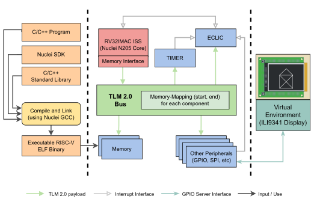

# Virtual Prototype (VP) for the GD32VF103VBT6

This is a VP for the GD32VF103VBT6 MCU. The VP is base on the [RISC-V VP](https://github.com/agra-uni-bremen/riscv-vp). For information on the base VP and how to build the VP, see the top-level `README.md` or the original GitHub Repo. Here, only GD32 specifics are discussed.

## Basics

The VP models the [GD32VF103VBT6](https://www.gigadevice.com/product/mcu/risc-v/gd32vf103vbt6) MCU. This MCU contains an RV32IMAC core, namely the [Nuclei N205](https://www.nucleisys.com/product/200.php) core. This core was previously branded "Bumblebee Processor". The GD32VF103VBT6 is the RISC-V version of the GD32F103VBT6 which in turn is a clone of the STM32F103VB (using the ARM Cortex M3).

The architecture of the VP can be seen below:   


A detailed description of the MCU can be found in the [user manual](https://www.gigadevice.com.cn/Public/Uploads/uploadfile/files/20230209/GD32VF103_User_Manual_EN_Rev1.4.pdf). The description of the Nuclei ISA can be found [here](https://doc.nucleisys.com/nuclei_spec/). A detailed description of the VP can be found in [chapter 3](GD32_VP.pdf) of Florian Stögmüller's Master's Thesis.

## ISS

The Nuclei core has a few custom CSRs and does interrupt handling with ECLIC/TIMER instead of a PLIC/CLINT. Therefore, the [nuclei_core](../../vp/src/platform/gd32/nuclei_core) folder contains a Nuclei ISS class which inherits from the base ISS class. The same goes for the CSR table class. The base ISS was adapted by defining a few methods as virtual. This allows overwriting them in the Nuclei ISS.

## Peripherals

The following peripherals are implemented in this VP: GPIO, AFIO, EXTI, SPI, EXMC, RCU  

The USART in the GD32 MCU is very versatile. In this VP, we only implemented the write access to the data register by forwarding each write to the `stdout` of the host system.   

The GPIO module includes the GPIO server from the HiFive implementation. Slight adaptations are made in that: Similar to the SPI interface in the server, an EXMC interface was added. Also, the server now supports five ports, i.e., five instances of the GPIO server can run simultaneously. This is because the GD32 MCU contains five GPIO banks.

Interrupt handling is now done in the GPIO module in the `synchronousChange` method. On the real hardware, it is done in the EXIT unit.

## Interrupts

For interrupt handling the Nuclei core uses an ECLIC and a TIMER unit. The Timer unit handles timer and software interrupts and forwards them to the ECLIC. The ECLIC additionally receives external interrupts from other Peripherals and sends all interrupt signals to the core.

In this VP the interrupts are implemented differently: The ECLIC module has a priority queue to which new interrupts are added. The interrupts are sorted using a custom comparator. After each instruction, the ISS checks if an interrupt is pending. If so, the first interrupt in the priority queue is processed. The ISS has a field with a pointer to the ECLIC in order to access the queue.

The Timer unit uses the SystemC simulation time for the clock source.

## UI

The VP can be connected to a [virtual environment](../../env/gd32/vp-breadboard). This environment models the ILI9341 display with the XPT2046 touch controller. The main class is in the [tft.cpp](../../env/gd32/vp-breadboard/devices/c/tft.cpp).

### Build
```
cd /env/gd32/vp-breadboard
mkdir build 
cd build
cmake ..
make
```

### Run

```
./vp-breadboard
```

## TODOs

While the basic functions of the VP work there are still some things left to do and to improve:
- Implement remaining Peripherals.
- Implement remaining CSRs.
- Model the ECLIC more accurately.
- Include SyscallHanlder (c.f. HiFive implementation).
- In the [source Repo](https://github.com/agra-uni-bremen/riscv-vp) the GPIO server has been separated into its own [repo](https://github.com/agra-uni-bremen/virtual-breadboard). This could be done for this repo as well.
- Move interrupt handling from the GPIO module to the EXTI module.
- Timer unit: Solve the problem with scaler value (c.f. code comment in `vp/src/platform/gd32/timer.h`)

## macOS

When using macOS the setup can be a bit tricky. A Dockerfile and a setup guide are [provided](macOS-Config).   
Additionally, the Nuclei SDK might not compile. The solution is documented [here](SDK-wont-compile.txt).
